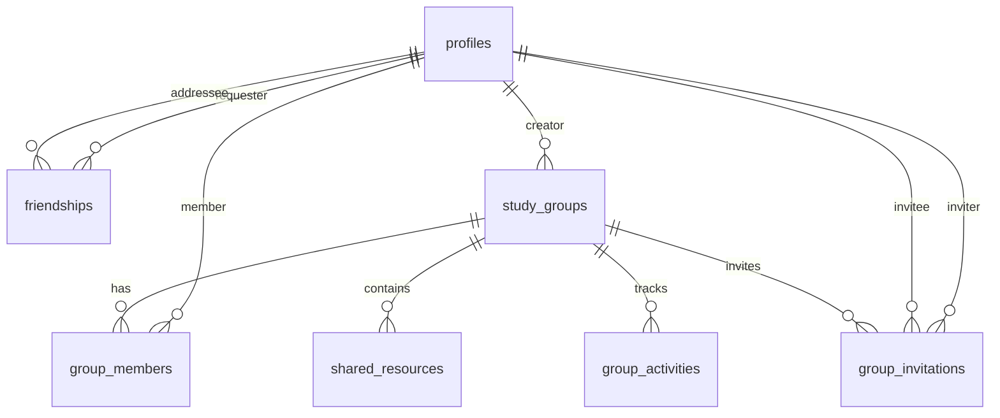

# 🤝 Sistema de Gerenciamento de Amigos - Documentação Completa

## 📋 **Visão Geral**

O Sistema de Gerenciamento de Amigos é uma funcionalidade que permite aos usuários se conectarem, colaborarem e competirem de forma saudável na plataforma de estudos. O sistema se integra perfeitamente com as funcionalidades existentes, criando uma experiência social e educacional rica.

## 🎯 **Objetivos Principais**

1. **Conexão Social**: Permitir que usuários se conectem e mantenham amizades
2. **Colaboração**: Facilitar o estudo em grupo e compartilhamento de conhecimento
3. **Motivação**: Criar responsabilidade social e competição saudável
4. **Gamificação**: Adicionar elementos de jogo para aumentar engajamento
5. **Networking**: Facilitar conexões profissionais e acadêmicas

## 🏗️ **Arquitetura do Sistema**

### **1. Estrutura de Banco de Dados**

#### **Tabela: friendships**

```sql
CREATE TABLE friendships (
  id UUID PRIMARY KEY DEFAULT gen_random_uuid(),
  requester_id UUID NOT NULL REFERENCES profiles(id) ON DELETE CASCADE,
  addressee_id UUID NOT NULL REFERENCES profiles(id) ON DELETE CASCADE,
  status friendship_status NOT NULL DEFAULT 'pending',
  created_at TIMESTAMP WITH TIME ZONE DEFAULT NOW(),
  updated_at TIMESTAMP WITH TIME ZONE DEFAULT NOW(),
  UNIQUE(requester_id, addressee_id)
);
```

#### **Tabela: friendship_status (Enum)**

```sql
CREATE TYPE friendship_status AS ENUM ('pending', 'accepted', 'rejected', 'blocked');
```

#### **Tabela: study_groups**

```sql
CREATE TABLE study_groups (
  id UUID PRIMARY KEY DEFAULT gen_random_uuid(),
  name VARCHAR(100) NOT NULL,
  description TEXT,
  creator_id UUID NOT NULL REFERENCES profiles(id) ON DELETE CASCADE,
  is_public BOOLEAN DEFAULT false,
  max_members INTEGER DEFAULT 50,
  created_at TIMESTAMP WITH TIME ZONE DEFAULT NOW(),
  updated_at TIMESTAMP WITH TIME ZONE DEFAULT NOW()
);
```

#### **Tabela: group_members**

```sql
CREATE TABLE group_members (
  id UUID PRIMARY KEY DEFAULT gen_random_uuid(),
  group_id UUID NOT NULL REFERENCES study_groups(id) ON DELETE CASCADE,
  user_id UUID NOT NULL REFERENCES profiles(id) ON DELETE CASCADE,
  role group_role NOT NULL DEFAULT 'member',
  joined_at TIMESTAMP WITH TIME ZONE DEFAULT NOW(),
  UNIQUE(group_id, user_id)
);
```

#### **Tabela: group_role (Enum)**

```sql
CREATE TYPE group_role AS ENUM ('admin', 'moderator', 'member');
```

#### **Tabela: group_invitations**

```sql
CREATE TABLE group_invitations (
  id UUID PRIMARY KEY DEFAULT gen_random_uuid(),
  group_id UUID NOT NULL REFERENCES study_groups(id) ON DELETE CASCADE,
  inviter_id UUID NOT NULL REFERENCES profiles(id) ON DELETE CASCADE,
  invitee_id UUID NOT NULL REFERENCES profiles(id) ON DELETE CASCADE,
  status invitation_status NOT NULL DEFAULT 'pending',
  message TEXT,
  created_at TIMESTAMP WITH TIME ZONE DEFAULT NOW(),
  expires_at TIMESTAMP WITH TIME ZONE DEFAULT (NOW() + INTERVAL '7 days')
);
```

#### **Tabela: invitation_status (Enum)**

```sql
CREATE TYPE invitation_status AS ENUM ('pending', 'accepted', 'declined', 'expired');
```

#### **Tabela: shared_resources**

```sql
CREATE TABLE shared_resources (
  id UUID PRIMARY KEY DEFAULT gen_random_uuid(),
  group_id UUID NOT NULL REFERENCES study_groups(id) ON DELETE CASCADE,
  user_id UUID NOT NULL REFERENCES profiles(id) ON DELETE CASCADE,
  type resource_type NOT NULL,
  title VARCHAR(200) NOT NULL,
  description TEXT,
  url TEXT,
  file_path TEXT,
  created_at TIMESTAMP WITH TIME ZONE DEFAULT NOW()
);
```

#### **Tabela: resource_type (Enum)**

```sql
CREATE TYPE resource_type AS ENUM ('pdf', 'link', 'note', 'question', 'quiz');
```

#### **Tabela: group_activities**

```sql
CREATE TABLE group_activities (
  id UUID PRIMARY KEY DEFAULT gen_random_uuid(),
  group_id UUID NOT NULL REFERENCES study_groups(id) ON DELETE CASCADE,
  user_id UUID NOT NULL REFERENCES profiles(id) ON DELETE CASCADE,
  type activity_type NOT NULL,
  title VARCHAR(200) NOT NULL,
  description TEXT,
  metadata JSONB,
  created_at TIMESTAMP WITH TIME ZONE DEFAULT NOW()
);
```

#### **Tabela: activity_type (Enum)**

```sql
CREATE TYPE activity_type AS ENUM ('quiz_completed', 'goal_achieved', 'resource_shared', 'study_session', 'challenge_created');
```

### **2. Relacionamentos**



## 🚀 **Funcionalidades Principais**

### **1. Sistema de Amizades**

#### **1.1 Gerenciamento de Amizades**

- **Enviar solicitação** de amizade
- **Aceitar/Rejeitar** solicitações
- **Lista de amigos** com status online/offline
- **Bloquear usuários** indesejados
- **Remover amigos** da lista

#### **1.2 Perfil Social**

- **Perfil público** visível para amigos
- **Estatísticas compartilhadas** (opcional)
- **Status de estudo** em tempo real
- **Atividades recentes** visíveis para amigos

### **2. Grupos de Estudo**

#### **2.1 Criação e Gerenciamento**

- **Criar grupos** públicos ou privados
- **Definir limites** de membros
- **Configurar permissões** e roles
- **Personalizar** com descrição e regras

#### **2.2 Sistema de Membros**

- **Convidar usuários** por email ou username
- **Gerenciar roles** (admin, moderador, membro)
- **Aprovar solicitações** de entrada
- **Remover membros** quando necessário

#### **2.3 Recursos Compartilhados**

- **Compartilhar PDFs** e materiais
- **Links úteis** para estudo
- **Anotações colaborativas**
- **Questões e quizzes** em grupo

### **3. Colaboração e Interação**

#### **3.1 Sistema de Chat**

- **Chat em grupo** para discussões
- **Chat privado** entre amigos
- **Notificações** de mensagens
- **Histórico** de conversas

#### **3.2 Atividades Compartilhadas**

- **Sessões de estudo** em grupo
- **Desafios colaborativos**
- **Metas em grupo**
- **Celebração** de conquistas

### **4. Gamificação Social**

#### **4.1 Rankings e Competição**

- **Ranking global** por matéria
- **Ranking entre amigos**
- **Ranking por grupo** de estudo
- **Conquistas** desbloqueáveis

#### **4.2 Desafios em Grupo**

- **Desafios semanais** colaborativos
- **Metas em grupo** com recompensas
- **Competições** entre grupos
- **Sistema de pontos** compartilhado

## 🎨 **Interface do Usuário**

### **1. Componentes Principais**

#### **1.1 FriendsList Component**

```typescript
interface FriendsListProps {
  friends: Friend[];
  onlineFriends: Friend[];
  pendingRequests: FriendRequest[];
  onSendRequest: (userId: string) => void;
  onAcceptRequest: (requestId: string) => void;
  onRejectRequest: (requestId: string) => void;
  onRemoveFriend: (friendId: string) => void;
}
```

#### **1.2 StudyGroups Component**

```typescript
interface StudyGroupsProps {
  userGroups: StudyGroup[];
  publicGroups: StudyGroup[];
  onCreateGroup: (groupData: CreateGroupData) => void;
  onJoinGroup: (groupId: string) => void;
  onLeaveGroup: (groupId: string) => void;
}
```

#### **1.3 GroupChat Component**

```typescript
interface GroupChatProps {
  groupId: string;
  messages: ChatMessage[];
  onSendMessage: (message: string) => void;
  onLoadMore: () => void;
}
```

#### **1.4 SocialDashboard Component**

```typescript
interface SocialDashboardProps {
  friends: Friend[];
  groups: StudyGroup[];
  activities: SocialActivity[];
  achievements: Achievement[];
}
```

### **2. Layout e Navegação**

#### **2.1 Sidebar Social**

- **Lista de amigos** online
- **Grupos ativos** do usuário
- **Notificações** sociais
- **Chat rápido** com amigos

#### **2.2 Página de Amigos**

- **Gerenciar amizades**
- **Perfis públicos** dos amigos
- **Atividades** dos amigos
- **Solicitações** pendentes

#### **2.3 Página de Grupos**

- **Meus grupos** de estudo
- **Grupos públicos** disponíveis
- **Criar novo grupo**
- **Gerenciar grupos** existentes

## 🔧 **Implementação Técnica**

### **1. Hooks Personalizados**

#### **1.1 useFriends**

```typescript
export const useFriends = () => {
  const [friends, setFriends] = useState<Friend[]>([]);
  const [pendingRequests, setPendingRequests] = useState<FriendRequest[]>([]);

  const sendFriendRequest = async (userId: string) => {
    /* ... */
  };
  const acceptFriendRequest = async (requestId: string) => {
    /* ... */
  };
  const rejectFriendRequest = async (requestId: string) => {
    /* ... */
  };
  const removeFriend = async (friendId: string) => {
    /* ... */
  };

  return {
    friends,
    pendingRequests,
    sendFriendRequest,
    acceptFriendRequest,
    rejectFriendRequest,
    removeFriend,
  };
};
```

#### **1.2 useStudyGroups**

```typescript
export const useStudyGroups = () => {
  const [userGroups, setUserGroups] = useState<StudyGroup[]>([]);
  const [publicGroups, setPublicGroups] = useState<StudyGroup[]>([]);

  const createGroup = async (groupData: CreateGroupData) => {
    /* ... */
  };
  const joinGroup = async (groupId: string) => {
    /* ... */
  };
  const leaveGroup = async (groupId: string) => {
    /* ... */
  };
  const inviteUser = async (groupId: string, userId: string) => {
    /* ... */
  };

  return {
    userGroups,
    publicGroups,
    createGroup,
    joinGroup,
    leaveGroup,
    inviteUser,
  };
};
```

#### **1.3 useSocialChat**

```typescript
export const useSocialChat = (groupId?: string) => {
  const [messages, setMessages] = useState<ChatMessage[]>([]);
  const [isConnected, setIsConnected] = useState(false);

  const sendMessage = async (message: string) => {
    /* ... */
  };
  const loadMoreMessages = async () => {
    /* ... */
  };

  useEffect(() => {
    // WebSocket connection for real-time chat
  }, [groupId]);

  return {
    messages,
    isConnected,
    sendMessage,
    loadMoreMessages,
  };
};
```

### **2. Serviços da API**

#### **2.1 FriendsService**

```typescript
export class FriendsService {
  static async getFriends(): Promise<Friend[]> {
    /* ... */
  }
  static async sendFriendRequest(userId: string): Promise<void> {
    /* ... */
  }
  static async acceptFriendRequest(requestId: string): Promise<void> {
    /* ... */
  }
  static async rejectFriendRequest(requestId: string): Promise<void> {
    /* ... */
  }
  static async removeFriend(friendId: string): Promise<void> {
    /* ... */
  }
  static async blockUser(userId: string): Promise<void> {
    /* ... */
  }
}
```

#### **2.2 StudyGroupsService**

```typescript
export class StudyGroupsService {
  static async getUserGroups(): Promise<StudyGroup[]> {
    /* ... */
  }
  static async getPublicGroups(): Promise<StudyGroup[]> {
    /* ... */
  }
  static async createGroup(groupData: CreateGroupData): Promise<StudyGroup> {
    /* ... */
  }
  static async joinGroup(groupId: string): Promise<void> {
    /* ... */
  }
  static async leaveGroup(groupId: string): Promise<void> {
    /* ... */
  }
  static async inviteUser(groupId: string, userId: string): Promise<void> {
    /* ... */
  }
  static async removeMember(groupId: string, userId: string): Promise<void> {
    /* ... */
  }
}
```

#### **2.3 ChatService**

```typescript
export class ChatService {
  static async getGroupMessages(
    groupId: string,
    limit = 50
  ): Promise<ChatMessage[]> {
    /* ... */
  }
  static async sendMessage(
    groupId: string,
    message: string
  ): Promise<ChatMessage> {
    /* ... */
  }
  static async getPrivateMessages(userId: string): Promise<ChatMessage[]> {
    /* ... */
  }
  static async sendPrivateMessage(
    userId: string,
    message: string
  ): Promise<ChatMessage> {
    /* ... */
  }
}
```

### **3. Integração com Sistema Existente**

#### **3.1 Dashboard Social**

- **Widget de amigos** online
- **Atividades** dos amigos
- **Grupos ativos** do usuário
- **Notificações** sociais

#### **3.2 Metas e Desafios**

- **Metas em grupo** colaborativas
- **Desafios** entre amigos
- **Ranking** social
- **Conquistas** compartilhadas

#### **3.3 Sistema de Tags**

- **Tags de grupo** para organização
- **Tags sociais** para conexões
- **Filtros** por amigos/grupos

## 📱 **Responsividade e Mobile**

### **1. Adaptações Mobile**

- **Sidebar colapsável** em telas pequenas
- **Chat em modal** para mobile
- **Navegação por tabs** para funcionalidades sociais
- **Gestos touch** para interações

### **2. Notificações Push**

- **Notificações** de mensagens
- **Alertas** de atividades dos amigos
- **Convites** para grupos
- **Lembretes** de desafios

## 🔒 **Segurança e Privacidade**

### **1. Controle de Acesso**

- **RLS (Row Level Security)** no Supabase
- **Políticas** de acesso por amizade
- **Configurações** de privacidade por usuário
- **Moderação** de conteúdo em grupos

### **2. Políticas de Privacidade**

- **Dados pessoais** protegidos
- **Configurações** de visibilidade
- **Bloqueio** de usuários indesejados
- **Reporte** de comportamento inadequado

## 🚀 **Roadmap de Implementação**

### **Fase 1: Sistema Básico de Amizades (Semana 1-2)**

- [ ] Estrutura de banco de dados
- [ ] API básica de amizades
- [ ] Componente de lista de amigos
- [ ] Sistema de solicitações

### **Fase 2: Grupos de Estudo (Semana 3-4)**

- [ ] Tabelas de grupos
- [ ] API de grupos
- [ ] Interface de criação/gerenciamento
- [ ] Sistema de convites

### **Fase 3: Chat e Colaboração (Semana 5-6)**

- [ ] Sistema de chat em grupo
- [ ] Chat privado entre amigos
- [ ] Compartilhamento de recursos
- [ ] Atividades colaborativas

### **Fase 4: Gamificação Social (Semana 7-8)**

- [ ] Sistema de rankings
- [ ] Desafios em grupo
- [ ] Conquistas sociais
- [ ] Dashboard social integrado

### **Fase 5: Polimento e Testes (Semana 9-10)**

- [ ] Testes de integração
- [ ] Otimizações de performance
- [ ] Testes de usabilidade
- [ ] Documentação final

## 📊 **Métricas de Sucesso**

### **1. Engajamento**

- **Usuários ativos** socialmente
- **Tempo gasto** em funcionalidades sociais
- **Frequência** de interações
- **Retenção** de usuários sociais

### **2. Colaboração**

- **Grupos criados** e ativos
- **Recursos compartilhados**
- **Mensagens trocadas**
- **Sessões de estudo** em grupo

### **3. Performance**

- **Tempo de resposta** das APIs
- **Uso de recursos** do servidor
- **Escalabilidade** do sistema
- **Qualidade** da experiência do usuário

## 🧪 **Testes e Qualidade**

### **1. Testes Unitários**

- **Hooks** personalizados
- **Serviços** da API
- **Utilitários** e helpers
- **Validações** de dados

### **2. Testes de Integração**

- **Fluxos** de amizade
- **Criação** de grupos
- **Sistema** de chat
- **Colaboração** em tempo real

### **3. Testes de Usabilidade**

- **Interface** intuitiva
- **Fluxos** de usuário
- **Responsividade** mobile
- **Acessibilidade**

## 📚 **Recursos e Referências**

### **1. Documentação Técnica**

- [Supabase Documentation](https://supabase.com/docs)
- [React Query](https://tanstack.com/query/latest)
- [WebSocket API](https://developer.mozilla.org/en-US/docs/Web/API/WebSocket)
- [Real-time Features](https://supabase.com/docs/guides/realtime)

### **2. Padrões de Design**

- [Material Design](https://material.io/design)
- [Ant Design](https://ant.design/)
- [Chakra UI](https://chakra-ui.com/)
- [Tailwind CSS](https://tailwindcss.com/)

### **3. Melhores Práticas**

- [React Best Practices](https://react.dev/learn)
- [TypeScript Guidelines](https://www.typescriptlang.org/docs/)
- [Database Design](https://www.postgresql.org/docs/)
- [Security Best Practices](https://owasp.org/www-project-top-ten/)

---

## 🎯 **Próximos Passos**

1. **Revisar** esta documentação
2. **Aprovar** a arquitetura proposta
3. **Começar** com a Fase 1 (Sistema de Amizades)
4. **Implementar** gradualmente cada funcionalidade
5. **Testar** e iterar continuamente

**Preparado para começar a implementação?** 🚀
